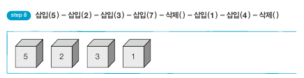
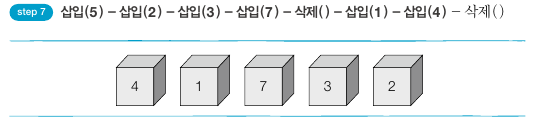
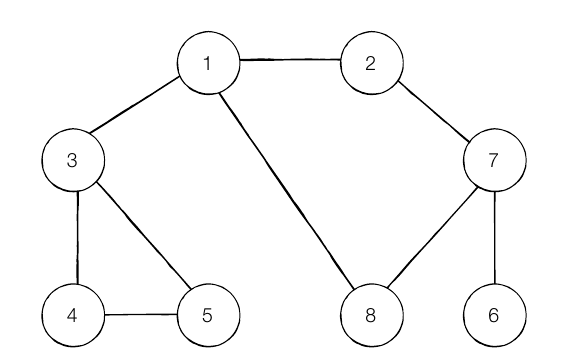

| 주요알고리즘     | 진행|  소스코드   |  이론정리    |  블로그정리  |
| ---- | ---- | ---- | ---- | ---- |
|   5.DFS/BFS   | ✔ |  [코드](https://github.com/YoonJoony/thisiscoding/tree/main/2%EC%9E%A5%20%EC%A3%BC%EC%9A%94%20%EC%95%8C%EA%B3%A0%EB%A6%AC%EC%A6%98%20%EC%9D%B4%EB%A1%A0%EA%B3%BC%20%EC%8B%A4%EC%A0%84%20%EB%AC%B8%EC%A0%9C/CHAP%2003.%20%EA%B7%B8%EB%A6%AC%EB%94%94)   |    [이론](https://github.com/YoonJoony/thisiscoding/blob/main/2%EC%9E%A5%20%EC%A3%BC%EC%9A%94%20%EC%95%8C%EA%B3%A0%EB%A6%AC%EC%A6%98%20%EC%9D%B4%EB%A1%A0%EA%B3%BC%20%EC%8B%A4%EC%A0%84%20%EB%AC%B8%EC%A0%9C/CHAP%2003.%20%EA%B7%B8%EB%A6%AC%EB%94%94/README.md)   |    [설명 & 해설](https://velog.io/@dbswns1101/CHAP03.-%EA%B7%B8%EB%A6%AC%EB%93%9C-%EC%95%8C%EA%B3%A0%EB%A6%AC%EC%A6%98)    |

➡️ 💡 ❗ 📌  🎨

##  DFS/BFS 이론
### 💡 꼭 필요한 자료구조 기초

#### 탐색 : 많은 양의 데이터 중 원하는 데이터 찾는 과정

➡️ DFS/BFS 원리를 이해하려면 기본 자료구조인 스택과 큐의 이해를 필요.
 
 

#### 자료구조 : '데이터를 표현하고 관리하고 처리하기 위한 구조'
- 삽입(Push) : 데이터를 삽입
- 삭제(Pop) : 데이터를 삭제
 
 
 

### 스택

박스쌓기에 비유할 수 있음.
 
ex) 흔히 박스는 아래에서 위로 쌓음. 정처기에서 질리도록 배웠쥬?
 
> 선입후출(First In Last Out) 구조 or 후입선출 구조.

### 큐

대기줄에 비유할 수 있음.
 
ex) 놀이공원 입장 시 줄 설때 먼저 온 사람 들어가고 나중에온 사람이 나중에 들어감.
 
> 선입선출(First In First Out) 구조 or 후이선출 구조.

### 인접 행렬과 인접 리스트의 차이

🎨 인접 행렬
~~~py
graph = [
    [0, 7, 5],
    [7, 0, INF],
    [5, INF, 0]
]
~~~
 

🎨 인접 리스트
~~~py
graph =[[] for _ in range(3)]

graph[0].append((1, 7))
graph[0].append((1, 7))

graph[1].append((1, 7))

graph[2].append((1, 7))
~~~
 
 

두 방식의 차이는 메모리와 속도 측면 차이가 있다.
 
- 인접 행렬 : 모든 관계를 저장하기 때문에 불필요한 메모리 낭비
- 인접 리스트 : 연결된 정보만 저장  (노드1, 5(간선)) 메모리 효율적.

하지만 반대로 인접 리스트는 데이터를 하나 하나 확인해야 하니 속도가 느림.

➡️ 특정 노드와 연결된 모든 인접 노드를 순회해야 하는 경우 -> 인접 리스트

### DFS (깊이 우선 탐색 알고리즘)
: 특정 경로를 탐색하다 특정 상황에 최대한 깊숙히 들어가 노드를 방문 후, 다시 돌아가 경로 탐색

 

#### DFS 동작 과정

1. 탐색 시작 노드를 스택 삽입 후 방문 처리
2. 스택의 최상단 노드에 방문안한 인접 노드를 스택에 넣고 방문 처리. 방문 안한 인접 노드 없으면 최상단 노드를 꺼낸다.
3. 2번 과정을 더 이상 못할 때까지 반복.

 

### 방문 순서 : 1 -> 2 -> 7 -> 6 -> 8 -> 3 -> 4 -> 5

### BFS (너비 우선 탐색 알고리즘)
: 가까운 노드부터 탐색하는 알고리즘

 

#### DFS 동작 과정

1. 탐색 시작 노드를 스택 삽입 후 방문 처리
2. 스택의 최상단 노드에 방문안한 인접 노드를 스택에 넣고 방문 처리. 방문 안한 인접 노드 없으면 최상단 노드를 꺼낸다.
3. 2번 과정을 더 이상 못할 때까지 반복.

 

### 방문 순서 : 1 -> 2 -> 7 -> 6 -> 8 -> 3 -> 4 -> 5
